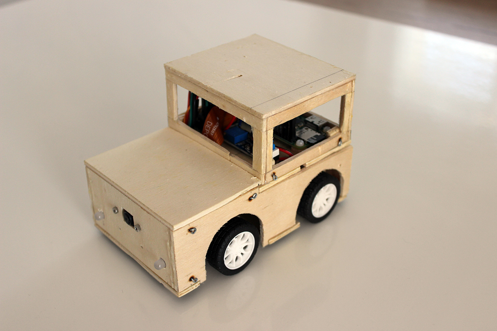
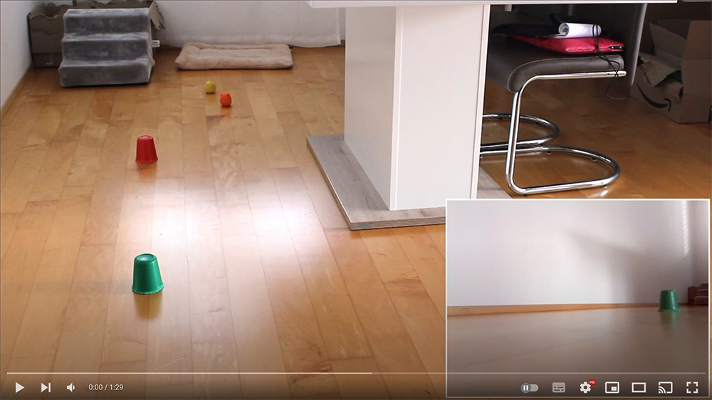

# Remote Car

I made a small (13x8cm) wood remote car with a real-time camera. The car is controlled with a joystick or by a [a text stream](https://framework.mathieu.guillame-bert.com/documentation_honey_tutorial_beginner.html) over udp or tcp.



[](https://youtu.be/Unp960vsMwE)

[More pictures](https://photos.app.goo.gl/YScf1Ado4gzN9pAS6)

## Requirements

### On contoller host (the computer with the jostick and display screen)

Tested on Linux (Ubuntoo) and Windows 10.

- GStreamer Runtime

  - [On linux](https://gstreamer.freedesktop.org/documentation/installing/on-linux.html)
    - `sudo apt install gstreamer1.0-tools`
  - [On Windows](https://gstreamer.freedesktop.org/documentation/installing/on-windows.html)
    - Make sure the command `gst-launch-1.0` works. On Windows, you might have to add gstreamer's bin directory to the `Path` environment variable.

- Python packages
  - inputs

### On runner host (the raspberry pi in the remote car)

- Python packages
  - gpiozero

## Installation

- Clone this repo
- Set the ip address of the car / runner host in `config.sh`.
- _[Recommanded]_ Configure a private/public key to connect in ssh from the controller host to the runner host without typing a password.

## Run

In `src` dirctory, on the controller host, run:

Test that the controller host (remote car / rpi) is accessible from the controller.

```shell
# Make sure the rpi is available
# Stop (ctrl+c) once the ping succeed.
./ping.sh
```

Test that the jostick is connected on the runner host (the computer with the display).

```shell
# You should see a csv-like file printed on the screen with new rows when you use the jostick.
# Stop (ctrl+c) once this work.
python3 controller.py
```

Finally, run:

```shell
# Upload the controller code on the rpi, start the controller code, and start the runner code.
# After a few seconds, a windows with the video stream appear and the car can be controlled with your jostick.
./start.sh
```
